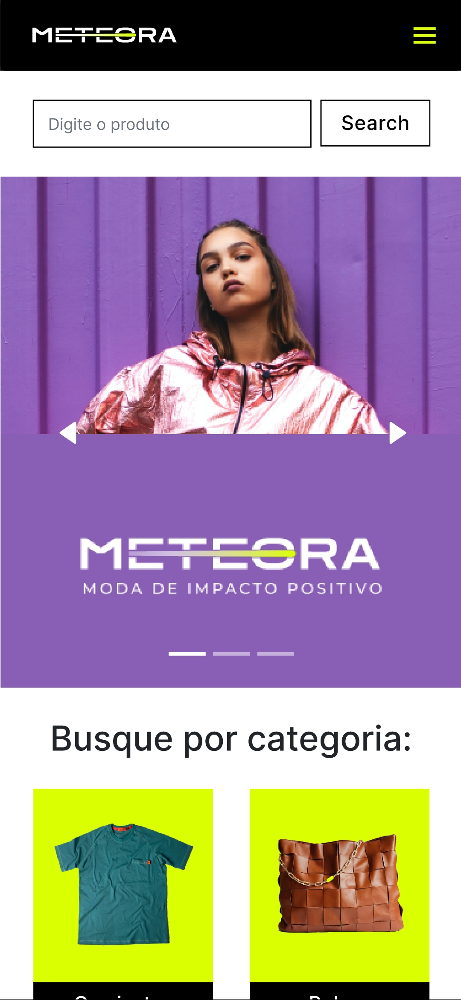

# AluraChallenge Front-End (7° edição) - Meteora

O projeto <strong>Meteora</strong> é uma simulação de plataforma online que oferece uma imersão no universo da moda. Os usuários podem explorar categorias variadas, pesquisar produtos específicos e adicionar itens ao carrinho dinamicamente. Com uma interface intuitiva, o Meteora simplifica a descoberta de novas tendências e oferece uma experiência personalizada de compra.

---
| :placard:  Vitrine.Dev |     |
| -------------  | --- |
| :sparkles: Nome        | **Meteora**
| :label: Tecnologias | JavaScript, React, Sass, Swiper js, Context API
| :rocket: URL         | https://meteora-pink.vercel.app/
| :fire: Desafio     | aluraChallenge Front-End (7° edição)
---

Tecnologias utilizadas:

    
    
    

 

## :thinking: Sobre o Desafio

O projeto proposto pela Alura, consiste em um desafio que busca simular um ambiente de trabalho real. A equipe da Alura nos forneceu um design já elaborado no FIGMA, além de um controle no TRELLO para gerenciar o projeto.

Durante as 4 semanas de duração do desafio, os instrutores estão disponíveis para nos fornecer dicas e orientações sobre como realizar as atividades propostas de maneira mais eficiente. Eles também recomendam um plano de estudos que podemos seguir para nos prepararmos adequadamente para os desafios que serão apresentados.

Participando desse projeto, pode-se vivenciar de forma prática as etapas de um projeto de desenvolvimento de software, desde a elaboração do design até a implementação das funcionalidades.

 

## :mag: Preview do projeto:

<h4 align="center">Mobile<h4>
    

 

<h4 align="center">Desktop<h4>

 

:coffee: Desenvolvido por <a href="https://github.com/gabrielfelipeee" target="_blank">Gabriel Felipe</a>!
